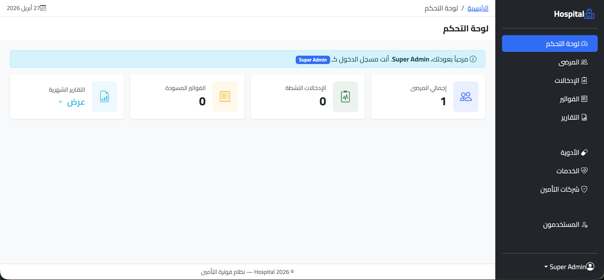
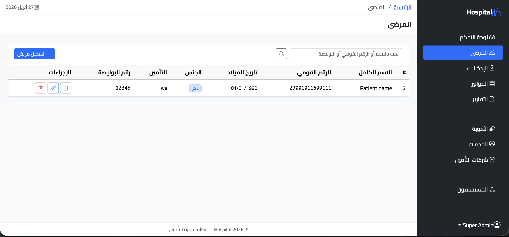
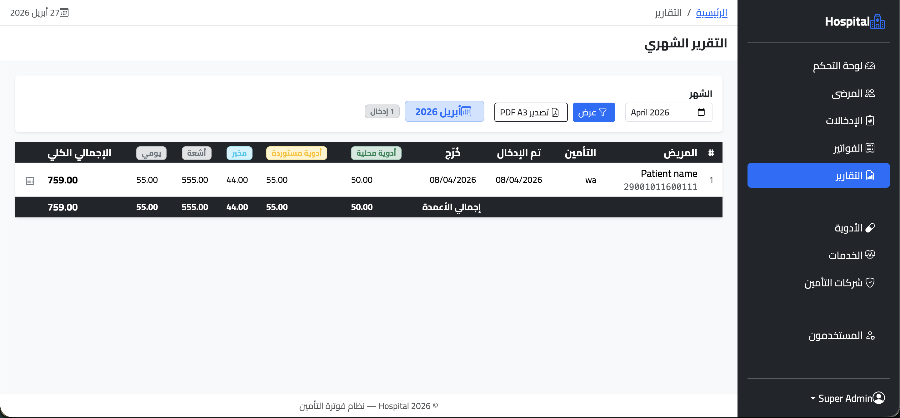

# Hospital Insurance Billing System

[](https://laravel.com)
[](https://www.php.net)
[](https://www.mysql.com)
[](https://tailwindcss.com)
[](https://opensource.org/licenses/MIT)

A production web application for managing **inpatient insurance billing** in a hospital environment. The system tracks patients admitted under health insurance contracts, automatically charges daily services from the day of admission, and produces itemized invoices and monthly statements ready for submission to insurance carriers.

---

## The Business Problem

Insurance billing for inpatient stays is repetitive, error-prone, and audit-sensitive. Hospitals lose revenue when:

- Daily room and board charges are forgotten or miscounted between admission and discharge.
- Medications are billed under the wrong category, leading to claim rejections from insurance providers.
- Monthly reconciliation reports for insurance companies are assembled by hand from scattered spreadsheets.

This system removes those failure modes by making the billing pipeline deterministic: admit a patient, and every billable item is captured automatically and grouped into the exact sections insurance carriers expect.

---

## Key Features

### Automated Daily Charging
The moment a patient is admitted, the system creates a draft invoice and seeds **one line item per day per daily service** (room, nursing, etc.) for every day from admission to today. Implemented via an Eloquent observer — no cron lag, no missed days.

### Four-Section Itemized Invoices
Every invoice prints with the four sections insurance carriers require, each with its own subtotal:

1. **Local Medications**
2. **Imported Medications**
3. **Laboratory Tests**
4. **Radiology**

Section assignment is derived automatically from the catalog (a medication's `local`/`imported` type, a service's `lab`/`radiology` category) — billing staff cannot mis-categorize an item.

### Draft / Final Invoice Lifecycle
Invoices are mutable while in `draft` status and locked once finalized. Adding or removing items on a finalized invoice raises a domain exception — preventing accidental edits to claims that have already been submitted.

### Monthly A3 Landscape PDF Report
A single click produces a print-ready monthly report — every admission for the period, every line item grouped by section, with column-level totals and a grand total. Output is **A3 landscape PDF** rendered server-side with DomPDF, ready to send to the insurance carrier.

### Patient & Admission Management
Full lifecycle: register patient → link to insurance company and policy → admit → discharge. Discharge is a dedicated action, not just a status flip, so end-of-stay reconciliation runs cleanly.

### Catalog Management
Medications and services are managed independently of billing, so price changes don't retroactively rewrite historical invoices (unit prices are denormalized onto invoice items).

### Role-Based Access Control
Four roles with discrete permissions, enforced both at the route layer (Spatie middleware) and the view layer (Blade `@can` directives). User accounts can be soft-disabled (`is_active` flag) without deletion.

### Bilingual Interface
First-class Arabic localization (`lang/ar/`, `lang/ar.json`) alongside English, suitable for hospitals operating in Arabic-speaking markets.

---

## Tech Stack

| Layer | Technology |
|---|---|
| Framework | **Laravel 13** |
| Language | **PHP 8.3+** |
| Database | **MySQL** |
| Frontend | **Blade + Tailwind CSS 4** |
| Build tool | **Vite 8** |
| Authorization | `spatie/laravel-permission` 7.x |
| PDF rendering | `barryvdh/laravel-dompdf` 3.x |
| User feedback | `realrashid/sweet-alert` 7.x |
| Code style | Laravel Pint |
| Testing | PHPUnit 12 |
| Logs / DX | Laravel Pail |

---

## Architecture Highlights

This is not a tutorial-grade Laravel app. The codebase follows discipline that holds up under real maintenance:

- **Thin controllers, fat services.** Every controller delegates to a domain service (`PatientService`, `AdmissionService`, `InvoiceService`, `ReportService`, etc.) injected via constructor with `readonly` promotion. Controllers do request validation and view selection — nothing else.
- **Domain rules expressed as PHP enums.** Roles and permissions are `App\Enums\Role` and `App\Enums\Permission` backed enums — no string literals scattered through the code, refactor-safe, IDE-completable.
- **Polymorphic invoice items.** `invoice_items` uses `itemable_type` / `itemable_id` to point at either a `Medication` or a `Service`, with a denormalized `section` column for fast section-level aggregation in reports.
- **Observer-driven side effects.** `AdmissionObserver` handles the cross-aggregate write (admission created → draft invoice + seeded daily items) so the controller stays single-purpose.
- **Lifecycle invariants enforced in the service layer.** Mutating a finalized invoice throws `LogicException` — the rule lives in code, not in a comment.
- **Eager loading on every list query.** Pagination methods explicitly load the relations the views need (`admission.patient.insuranceCompany`), eliminating N+1 queries on admin index pages.
- **Defensive route ordering.** Fixed-path routes (`/create`, `/print`, `/export`) are registered before wildcard `{model}` routes, with inline comments explaining why — a class of bug that bites every Laravel app eventually.
- **Search/filter via `when()` clauses with `withQueryString()`** so filters survive pagination links — small detail, big UX win.

---

## Installation

### Prerequisites

- PHP 8.3+
- Composer 2.x
- Node.js 20+ and npm
- MySQL 8.x

### Setup

```bash
# 1. Clone
git clone <repository-url> hospital
cd hospital

# 2. Install backend & frontend dependencies
composer install
npm install

# 3. Environment
cp .env.example .env
php artisan key:generate

# Edit .env — set DB_DATABASE, DB_USERNAME, DB_PASSWORD

# 4. Database — run migrations and seed roles + admin user
php artisan migrate --seed

# 5. Build frontend assets
npm run build
```

### Running locally

```bash
# Single dev command — runs server, queue worker, log tail, and Vite concurrently
composer dev
```

Or run pieces individually:

```bash
php artisan serve
npm run dev
```

### Default credentials

After seeding, log in with the credentials defined in `database/seeders/AdminUserSeeder.php`. Change them immediately on first login.

---

## User Roles & Permissions

Permissions are seeded by `RolesAndPermissionsSeeder` and enforced by Spatie middleware at the route level and `@can` directives in views.

| Role | Catalog | Patients | Admissions | Invoices | Reports | Users |
|---|---|---|---|---|---|---|
| **super_admin** | Full | Full | Full | Full (incl. delete & finalize) | Full | Full (CRUD + activate/deactivate) |
| **admin** | Full | Register / view | Manage | View, create, edit, finalize, print | View | — |
| **cashier** | — | — | View | View, print, confirm payment | — | — |
| **data_entry** | — | Register / view | View | View, add line items | — | — |

Underlying permissions: `manage_users`, `assign_roles`, `manage_catalog`, `register_patients`, `view_patients`, `manage_admissions`, `view_admissions`, `view_invoices`, `create_invoices`, `edit_invoices`, `delete_invoices`, `print_invoices`, `confirm_payment`, `add_invoice_items`, `view_reports`.

---

## Domain Model

```
patients ── insurance_companies
   │
   └── admissions ── invoices ── invoice_items (polymorphic → Medication | Service)
                                        │
                                        └── section: local_med | imported_med | lab | radiology | daily
```

Key invariants:
- Every admission has exactly one invoice (created automatically on admission).
- An invoice's `total_amount` is recalculated on every item mutation (`Invoice::recalculateTotal()`).
- Finalized invoices are immutable.
- `invoice_items.section` is denormalized at write time so monthly reports aggregate without joining the catalog.

---

## Screenshots

> Replace with real screenshots before publishing.

| | |
|---|---|
|  |  |
| Dashboard overview | Patient registry |
|  |  |
| Itemized invoice with four sections | A3 landscape monthly report |

---

## Project Structure

```
app/
  Enums/                  Role, Permission (typed enums)
  Http/Controllers/       Patient, Admission, Invoice, Report, User, Dashboard, Auth, Catalog/*
  Services/               Domain services injected into controllers
  Observers/              AdmissionObserver — auto-invoice + daily charges
  Models/                 Eloquent models
database/
  migrations/             Schema for patients, admissions, invoices, items, catalog, permissions
  seeders/                RolesAndPermissionsSeeder, AdminUserSeeder
resources/
  views/                  Blade templates per module + PDF templates
  views/invoices/print    Itemized invoice (PDF)
  views/reports/monthly_a3 A3 landscape monthly statement (PDF)
lang/
  ar/, ar.json            Arabic translations
routes/
  web.php                 Single source of truth, grouped by middleware
```

---

## License

Released under the [MIT License](https://opensource.org/licenses/MIT).

---

## About the Author

Built by **Wael Moharram** as a real-world hospital billing system. Open to freelance Laravel projects — admin systems, billing workflows, and B2B dashboards.

👉 [waelmoharram.com](http://www.waelmoharram.com)
